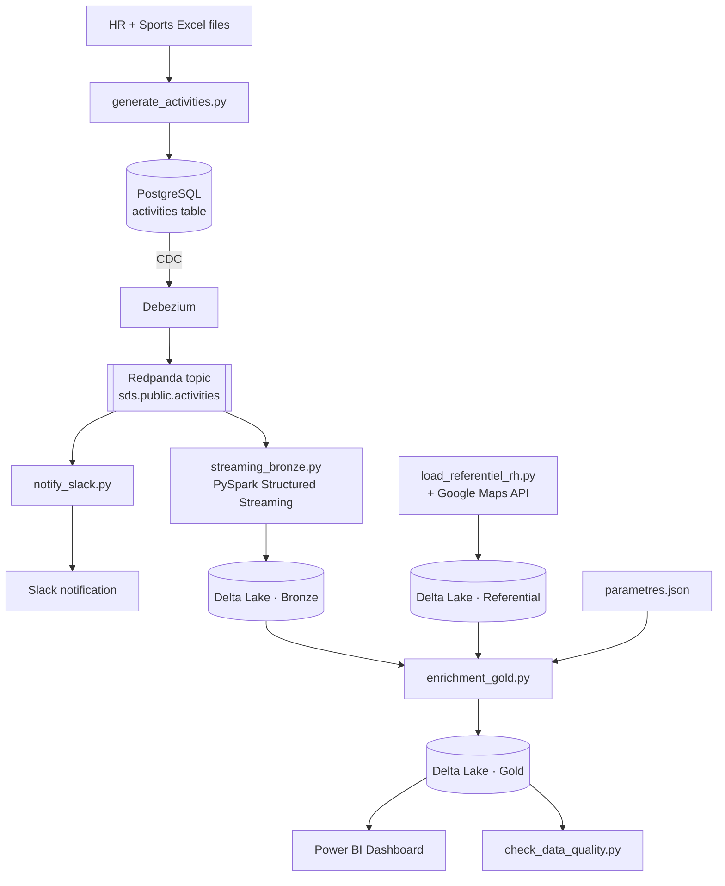

# --- Sport Data Solution — Real-Time Streaming & Lakehouse Pipeline ---

### End-to-End Real-Time Data Streaming & Lakehouse Architecture


---

## --- What is this project? ---

**Sport Data Solution** is a (fictional) startup that wants to reward employees
for staying active. This repo contains the full data pipeline I built for
their POC: it takes raw sports activity data, checks it's trustworthy,
figures out who qualifies for two employee perks, and shows the results on
a live dashboard — all automated, end to end.

The two perks:
-  **Mobility bonus** — +5% of annual gross salary for employees whose
  commute is validated as genuinely active (walking, running, cycling...).
-  **Wellness days** — paid time off for employees who hit a minimum
  number of sports activities per year.

The whole point of a POC like this is to prove the pipeline **works, is
trustworthy, and can adapt** if the business rules change — not just to
produce one static report.

---

## --- Architecture ---



In plain words: a generator simulates employee activity and writes it to
Postgres. Debezium watches that table and streams every change into
Redpanda, a Kafka-compatible message bus. From there, two things happen in
parallel — Spark writes a raw, trustworthy copy of every activity (the
**bronze** layer), and a notifier posts a congratulations message to Slack
in real time. Separately, a script enriches the HR file with real
commute distances (via Google Maps) to catch bogus declarations. A final
Spark job crosses the bronze data with that enriched HR data to compute
who's eligible for what, writes the **gold** layer, and Power BI reads
straight from it.

---

## --- Tech stack ---

| Layer | Tool | Role |
|---|---|---|
| Database | PostgreSQL | Source of truth for generated activities |
| CDC | Debezium | Streams every Postgres change in real time |
| Message broker | Redpanda | Kafka-compatible event bus |
| Processing | Apache Spark (PySpark) | Streaming ingestion + batch enrichment |
| Storage | Delta Lake | Bronze / Gold medallion architecture |
| Scripting | Python (pandas, psycopg2, kafka-python, Faker) | Data generation, enrichment, quality checks |
| Geolocation | Google Maps API | Validates declared commute distances |
| Messaging | Slack SDK (webhook) | Real-time activity notifications |
| Dashboard | Power BI | Final reporting, connected natively to Delta Lake |
| Infra | Docker Compose | One-command local environment |

---

## --- Project structure ---

```
sport-data-solution/
├── docker-compose.yml          # Spins up Postgres, Redpanda, Debezium Connect, Spark
├── sql/
│   └── init_postgres.sql       # Creates the activities table
├── connectors/
│   └── debezium-postgres-connector.json
├── generator/
│   └── generate_activities.py  # Simulates 12 months of activity history
├── referentiel/
│   └── load_referentiel_rh.py  # Enriches HR data with validated commute distance
├── spark_jobs/
│   ├── streaming_bronze.py     # Kafka → Delta Lake (bronze)
│   ├── enrichment_gold.py      # Bronze + HR → Delta Lake (gold)
│   └── config/
│       └── parametres.json     # Business rules (editable, no code change needed)
├── slack_notifier/
│   └── notify_slack.py         # Posts a Slack message per new activity
├── tests_qualite/
│   └── check_data_quality.py   # 11 automated consistency checks
└── data/                       # Local Delta Lake storage (bronze/gold)
```

---

## --- Getting started ---

**Prerequisites**
- [Docker Desktop](https://www.docker.com/products/docker-desktop/) (with Docker Compose)
- Python 3.10+
- Power BI Desktop (for the dashboard)
- A Slack workspace with an incoming webhook (optional — the notifier
  falls back to printing messages in the console if not configured)
- A Google Maps API key (optional — distances are marked "pending" until
  one is provided)

**Setup**

```bash
git clone <this-repo>
cd sport-data-solution
cp .env.example .env          # fill in your Slack webhook / Google Maps key if you have them
pip install -r requirements.txt
```

---
**Setup**

```bash
# 1. Clone the repository
git clone [https://github.com/yad95/OC-Projet-12-Realtime-Streaming-Pipeline-Architecture.git](https://github.com/yad95/OC-Projet-12-Realtime-Streaming-Pipeline-Architecture.git)
cd OC-Projet-12-Realtime-Streaming-Pipeline-Architecture

# 2. Create and activate a virtual environment
python -m venv venv

# On Windows:
venv\Scripts\activate
# On macOS/Linux:
source venv/bin/activate

# 3. Install Python dependencies
pip install -r requirements.txt

# 4. Configure environment variables (API keys)
cp .env.example .env
# Open the new .env file and paste your Slack Webhook URL and Google Maps API Key.
# Note: The pipeline will still run even if these keys are left empty.
## ---  Runbook — how to run the whole thing ---

```bash
# 1. Start the infrastructure (Postgres, Redpanda, Debezium, Spark)
docker compose up -d

# 2. Generate simulated activity data (12 months of history)
python generator/generate_activities.py --rh-file "Données RH.xlsx" --sport-file "Données Sportive.xlsx"

# 3. Build the enriched HR referential (commute distance validation)
python referentiel/load_referentiel_rh.py --rh-file "Données RH.xlsx"

# 4. Start the real-time bronze ingestion (leave this running)
docker exec -it sds_spark /opt/spark/bin/spark-submit \
  --packages io.delta:delta-spark_2.12:3.2.0,org.apache.spark:spark-sql-kafka-0-10_2.12:3.5.1 \
  /opt/spark_jobs/streaming_bronze.py

# 5. (optional, in a separate terminal) Start Slack notifications
python slack_notifier/notify_slack.py

# 6. Compute the gold layer (eligibility + costs)
docker exec -it sds_spark /opt/spark/bin/spark-submit \
  --packages io.delta:delta-spark_2.12:3.2.0 \
  /opt/spark_jobs/enrichment_gold.py

# 7. Run the data quality checks
python tests_qualite/check_data_quality.py
```

Then open the Power BI file and hit **Refresh** — it connects directly to
the Delta Lake gold folder, no export needed.

---

## --- Changing the business rules (no code required) ---

All the business logic lives in `spark_jobs/config/parametres.json`:

```json
{
  "taux_prime": 0.05,
  "seuil_activites_bien_etre": 15,
  "jours_bien_etre_accordes": 5
}
```

Change a value, re-run `enrichment_gold.py`, hit Refresh in Power BI — the
whole dashboard recalculates. No script to rewrite, no manual edits
elsewhere.

**Bonus — interactive simulation in Power BI itself.** On top of that, the
dashboard includes a dedicated "Simulator" page with live numeric sliders
(Power BI What-If parameters) for the activity threshold, the number of
wellness days granted, and the bonus rate. Moving a slider updates the
KPIs instantly — no file to edit, no job to re-run. Under the hood, Spark
pre-computes the outcome for every possible threshold (0 to 30) into a
small aggregated table, so the slider only ever reads pre-aggregated
totals — **no individual employee data (salary, name) ever reaches Power
BI**, by design.

---

## --- Data privacy & security ---

Since this pipeline touches sensitive HR data (salary, home address), a
few things were non-negotiable:

- Salary and address never leave the secure processing layer — not in
  Slack messages, not in the Power BI dashboard.
- The gold layer is split in two: a detailed table for internal use, and
  an aggregated, non-nominative table for Power BI.
- API keys and webhook URLs live in environment variables, never in the
  code.
- Every declared "active commute" is automatically cross-checked against
  a real distance (Google Maps API) to catch inconsistent declarations.

---

## --- Data quality ---

Before any number reaches the dashboard, `check_data_quality.py` runs 11
automated checks — no negative distances, no future dates, referential
integrity between activities and employees, consistent computed amounts,
and more. Current status: **11/11 passing**.

---

## --- Example results ---

On the simulated dataset (161 employees, ~6,600 generated activities):

-  ~172.5K€ total estimated mobility bonus budget
-  540 wellness days granted
-  0 distance anomalies detected

---

## --- Possible next steps ---

- Connect to the real Strava API instead of the simulator
- Move the local Docker infrastructure to a managed cloud environment
- Add proactive alerting on detected anomalies
- Dynamic Thresholds via Power BI: Allow business users to adjust activity thresholds and bonus rates directly from the dashboard interface without editing backend config files.
---

## 👤 Author

**YAD** — Data Engineer
Built as part of the OpenClassrooms Data Engineering program (Project 12 —
Managing an Infrastructure Project).
